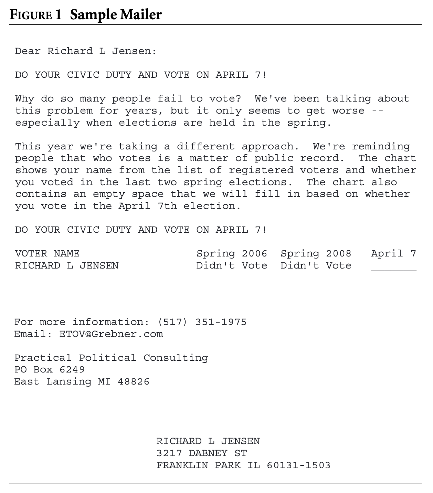

---
engines:
- path: /opt/quarto/share/extension-subtrees/julia-engine/\_extensions/julia-engine/julia-engine.js
execute:
  eval: false
resources:
- \*\*/\*Starter.pdf
- data/\*\*/\*.csv
- ../assets/
- ../37-wrap-up/Midterm Review Topics List.pdf
title: Problem Set 6
toc-title: Table of contents
---

1.  **Under pressure: Interference** (from G & G Ch. 8): In their study
    of spillover effects, Sinclair, McConnell, and Green[^1] sent
    mailings to randomly selected households in Chicago encouraging them
    to vote in an upcoming special election on April 7th 2009
    ([Figure 1](#fig-postcard){.quarto-xref}). The mailings used a form
    of social pressure, disclosing whether the targeted individual had
    voted in previous elections. Because this type of mail had proven to
    increase turnout by approximately 4-5 percentage points in previous
    experiments, the authors used it to study whether the treatment
    effects are transmitted across households.

    Employing a multilevel design, they randomly assigned all, half, or
    none of the members of each nine-digit zip code to receive mail. For
    purposes of this example, we focus only on households with one
    registered voter. The outcome variable is voter turnout as measured
    by the registrar of voters. The results are as follows. Among
    registered voters in untreated zip codes, 1,201 of 6,217 cast
    ballots. Among untreated voters in zip codes where half of the
    households received mail, 526 of 3,316 registered voters cast
    ballots. Among treated voters in zip codes where half of the
    households received mail, 620 of 2,949 voted. Finally, among treated
    voters in zip codes where every household received mail, turnout was
    1,316 of 6,377.

    a.  Identify the response variable, the units (measurement and
        experimental), and the experiental factor(s) and their levels.

    b.  Using potential outcomes, define the direct treatment effects
        (parameters) of receiving mail addressed to subject $i$.

    c.  Define the spillover treatment effects (also parameters) of
        being in a zip code where varying fractions of households are
        treated.

    d.  Propose an estimator for estimating the firsthand (direct) and
        secondhand (spillover) treatment effects. Show that the
        estimator is unbiased, explaining the assumptions required to
        reach this conclusion.

    e.  Based on these data, what are your estimates of the magnitude of
        the mailing's direct and spillover effects? What did we learn
        here scientifically?

    {width="300"}



2.  **Bring Out Your Bins: Non-compliance** Cotterill et al. report the
    results of an experiment conducted in an area of the United Kingdom
    where only half of the local residents recycle their trash[^2].
    Canvassers visited homes and encouraged residents to recycle.
    Outcomes were measured by whether the home put out a recycling bin
    on at least one occasion during the following three weeks. We
    restrict our attention here to homes that did not recycle trash
    during a pre-experimental period of observation. When implementing
    the intervention, researchers encountered one-side noncompliance:
    1,105 of the 1,849 homes assigned to the treatment group were
    successfully canvassed; none of the 1,430 homes assigned to the
    control group were canvassed. These researchers found that 591 homes
    in the treatment group recycled, as opposed to 377 in the control
    group. The researchers also observed that 429 of 1,105 homes that
    were successfully canvassed recycled, as opposed to 539 of the 2,264
    homes that were not canvassed.

<!-- -->

a.  Estimate the $ITT_Y$ and interpret what that statistic captures in
    the context of this study.

b.  Estimate the $ITT_D$ and interpret what that statistic captures.

c.  Estimate the $CACE$ and interpret what that statistic captures.

d.  Explain why comparing the recycling rates of the treated and
    untreated subjects tends to produce misleading estimates of the
    $CACE$ and the $ATE$.



3.  **Babies Walking: Adjusted** Consider an extended version of our
    familiar babies data set called `babies2`. As before, the unit is a
    single baby, the response is the number of months from birth until
    walking (`walk`), and the experimental variable is the `program`.
    There are two additional covariates, `income` and `sibs` (the number
    of siblings), which have both been normalized to have roughly mean
    zero and unit SD. You can load the data with the following:

    ::: cell
    ``` {.r .cell-code}
    babies2 <- read.csv("https://stat158.berkeley.edu/spring-2026/data/babies-walking/babies2.csv")
    ```
    :::

    a.  To establish a baseline analysis, calculate the F statistic from
        a one-way ANOVA for the effect of `program` on `walk` with no
        additional covariates. Conduct a hypothesis test on that
        statistic then report and interpret the p-value (you can use
        either a randomization test or the model-based F-test).

    b.  Create a pairs plot (see either `?pairs` or google `ggpairs`) of
        the data frame containing the response, the experimental factor,
        `income`, and `siblings`. Describe the extent to which the new
        covariates appear good predictors of the response and the degree
        to which they're collinear with one another.

    c.  Do a second analysis of the effect of `program` on `walk` but
        this time adjust for `income` and `siblings` using the F
        statistic from a partial F test. Again, report the p-value from
        your hypothesis test and describe why it differs, if at all,
        from the baseline analysis.

[^1]: Sinclair, McConnell, and Green (2012). *"Detecting Spillover
    Effects: Design and Analysis of Multilevel Experiments"* in
    *American Journal of Political Science*.

[^2]: Cotteril el al (2009). *"Mobilizing Citizen Effort to Enhance
    Environmental Outcomes: A Randomized Controlled Trail of a
    Door-to-Door Recycling Campaign."* in *Journal of Environmental
    Management*.
